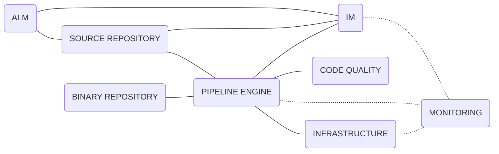

# Factory Components
<!-- TODO: Description of factory components -->

<!-- TOC -->
- [Tooling Roadmap](#tooling-roadmap)
- [Pipeline Engine](#pipeline-engine)
- [Source Repository](#source-repository)
- [Binary Repository](#binary-repository)
- [IM](#im)
- [Code Quality](#code-quality)
- [ALM](#alm)
- [Infrastructure](#infrastructure)
- [Monitoring](#monitoring)
<!-- /TOC -->

## Tooling Roadmap
<!-- TODO: Description of the tooling roadmap -->

### Integrated 

| Pipeline Engine | Source Repository | Binary Repository | IM | Code Quality | ALM | Infrastructure | Monitoring |
| --- | --- | --- | --- | --- | --- | --- | --- |
|  |  |  |  |  |  |  |  |

### Comming Soon

| Pipeline Engine | Source Repository | Binary Repository | IM | Code Quality | ALM | Infrastructure | Monitoring |
| --- | --- | --- | --- | --- | --- | --- | --- |
| Jenkins X | GitHub Repository | GitHub Packages | Slack | Sonar Cloud | GitHub Issues | GCP | Lens |
| GitHub Actions |  |  |  | Hound | GitHub Projects |  | Octant |
|  |  |  |  | Semantic Pull Requests |  |  | Lighthouse Dashboard |
|  |  |  |  | DCO |  |  | Grafana |
|  |  |  |  | dependabot |  |  | Prometheus |
|  |  |  |  | guide-bot |  |  |  |
|  |  |  |  | sonatype-lift |  |  |  |
|  |  |  |  |  |  |  |  |

### Backlog

| Pipeline Engine | Source Repository | Binary Repository | IM | Code Quality | ALM | Infrastructure | Monitoring |
| --- | --- | --- | --- | --- | --- | --- | --- |
| Terraform Cloud |  |  |  |  |  | Azure |  |
|  |  |  |  |  |  | AWS |  |
|  |  |  |  |  |  |  |  |

## Pipeline Engine
<!-- TODO: Description of Pipeline Engine component -->

## Source Repository
<!-- TODO: Description of Source Repository component -->

## Binary Repository
<!-- TODO: Description of Binary Repository component -->

## IM
<!-- TODO: Description of IM component -->

## Code Quality
<!-- TODO: Description of Code Quality component -->

## ALM
<!-- TODO: Description of ALM component -->

## Infrastructure
<!-- TODO: Description of Infrastructure component -->

## Monitoring
<!-- TODO: Description of Monitoring component -->

