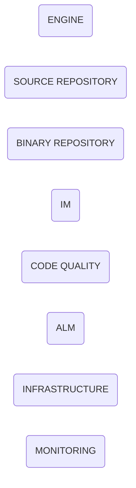

# Factory Components
<!-- TODO: Description of factory components -->

<!-- TODO: highlevel component architecture -->

<!-- TOC -->
- [Engine](#engine)
- [Source Repository](#source-repository)
- [Binary Repository](#binary-repository)
- [IM](#im)
- [Code Quality](#code-quality)
- [ALM](#alm)
- [Infrastructure](#infrastructure)
- [Monitoring](#monitoring)
<!-- /TOC -->

## Engine
<!-- TODO: Description of Engine component -->

## Source Repository
<!-- TODO: Description of Source Repository component -->

## Binary Repository
<!-- TODO: Description of Binary Repository component -->

## IM
<!-- TODO: Description of IM component -->

## Code Quality
<!-- TODO: Description of Code Quality component -->

## ALM
<!-- TODO: Description of ALM component -->

## Infrastructure
<!-- TODO: Description of Infrastructure component -->

## Monitoring
<!-- TODO: Description of Monitoring component -->

