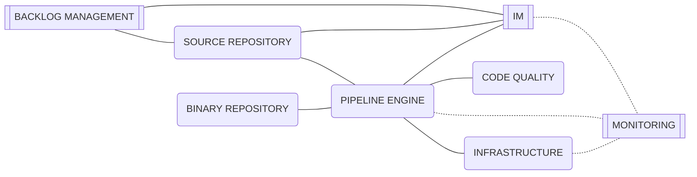
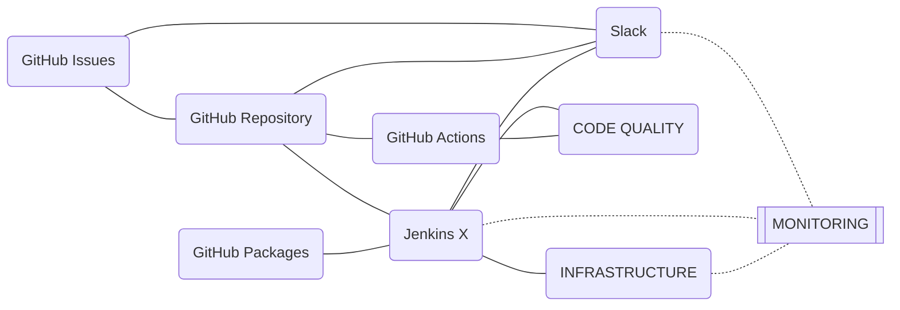
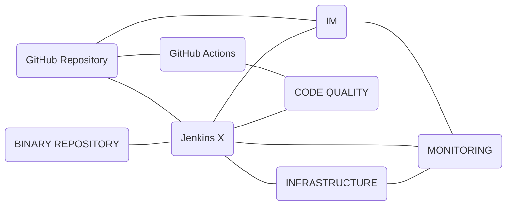

# Factory Components
<!-- TODO: Description of factory components -->

## Tooling Roadmap
<!-- TODO: Description of the tooling roadmap -->

 <!--

-->

### Ready 

| [Pipeline Engine](#pipeline-engine) | [Source Repository](#source-repository) | [Binary Repository](#binary-repository) | [IM](#im) | [Code Quality](#code-quality) | [Backlog Management](#backlog-management) | [Infrastructure](#infrastructure) | [Monitoring](#monitoring) |
| --- | --- | --- | --- | --- | --- | --- | --- |
|  |  |  |  |  |  |  |  |

### Comming Soon

| [Pipeline Engine](#pipeline-engine) | [Source Repository](#source-repository) | [Binary Repository](#binary-repository) | [IM](#im) | [Code Quality](#code-quality) | [Backlog Management](#backlog-management) | [Infrastructure](#infrastructure) | [Monitoring](#monitoring) |
| --- | --- | --- | --- | --- | --- | --- | --- |
| Jenkins X | GitHub Repository | GitHub Packages | Slack | Sonar Cloud | GitHub Issues | GCP | Grafana |
| GitHub Actions |  |  |  | Hound | GitHub Projects |  | jx Dashboard |
|  |  |  |  | Semantic Pull Requests |  |  | Lighthouse UI |
|  |  |  |  | DCO |  |  |  |
|  |  |  |  | dependabot |  |  |  |
|  |  |  |  | guide bot |  |  |  |
|  |  |  |  | sonatype lift |  |  |  |
|  |  |  |  |  |  |  |  |

### Under Review

| [Pipeline Engine](#pipeline-engine) | [Source Repository](#source-repository) | [Binary Repository](#binary-repository) | [IM](#im) | [Code Quality](#code-quality) | [Backlog Management](#backlog-management) | [Infrastructure](#infrastructure) | [Monitoring](#monitoring) |
| --- | --- | --- | --- | --- | --- | --- | --- |
| Terraform Cloud |  |  |  |  |  | Azure | Octant |
|  |  |  |  |  |  | AWS | Lens |
|  |  |  |  |  |  |  |  |

---

## Components Overivew

### Pipeline Engine
<!-- TODO: add description of Pipeline Engine component 

-->

#### Jenkins X
<!-- TODO: add Jenkins X configuraion -->
- jx-pipelines-visualizer
- jxgh/cd-indicators
- jx-slack
- lighthouse-webui-plugin
- jx-observability

#### GitHub Actions
<!-- TODO: add GitHub Actions configuraion -->
- dependabot
- dco
- semantic
- sonarsource/sonarcloud-github-action
- actions/stale@v3

---

### Source Repository
<!-- TODO: add description of Source Repository component -->

#### GitHub Repository
<!-- TODO: add GitHub Repository configuraion -->

---

### Binary Repository
<!-- TODO: add description of Binary Repository component -->

---

### IM
<!-- TODO: add description of IM component -->

---

### Code Quality
<!-- TODO: add description of Code Quality component -->

#### Review
<!-- TODO: add Review configuraion -->

#### SCA
<!-- TODO: add SCA configuraion -->

#### Secutiry Testing
<!-- TODO: add Secutiry Testing configuraion -->

#### Unit Testing
<!-- TODO: add Unit Testing configuraion -->

#### Behaviour Testing
<!-- TODO: add Behaviour Testing configuraion -->

---

### Backlog Management
<!-- TODO: add description of Backlog Management component -->

---

### Infrastructure
<!-- TODO: add description of Infrastructure component -->

---

### Monitoring
<!-- TODO: add description of Monitoring component -->

#### Grafana
<!-- TODO: add Grafana configuraion -->
- Promtail
- Loki
- Tempo
- Prometheus

---

