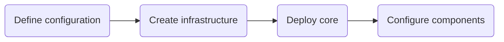

# The Factory Journeys

<!-- TOC -->
- [Build the factory](#build-the-factory)
- [Maintain the factory](#maintain-the-factory)
- [On-Demand factory](#on-demand-factory)
- Quickstart projects
- Pipeline library
- Factory bot
- Documentation production
- Governance
<!-- /TOC -->

## Build the factory
<!-- TODO: Goal Desc - Build the Factory -->


The journey backlog can be found [here]().

## Maintain the factory
<!-- TODO: Goal Desc - Maintain the factory -->

```mermaid
flowchart LR

```
The journey backlog can be found [here]().

## On-demand factory
<!-- TODO: Goal Desc - On-demand factory management -->

```mermaid
flowchart LR
    
```
The journey backlog can be found [here]().
