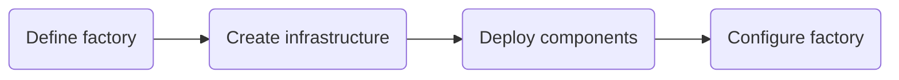
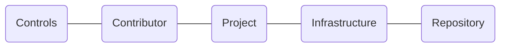

# The Factory Journeys

<!-- TOC -->
- [Build the factory](#build-the-factory)
- [Maintain the factory](#maintain-the-factory)
- Factory cli
- Quickstart projects
- Pipeline library
- Factory bot
- Documentation production
- Governance
- On-demand
<!-- /TOC -->

## Build the factory
<!-- TODO: Journey Desc - Build the Factory -->

The journey backlog can be found [here]().

## Maintain the factory
<!-- TODO: Journey Desc - Maintain the factory -->

The journey backlog can be found [here]().

