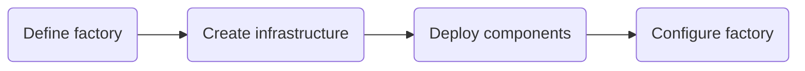
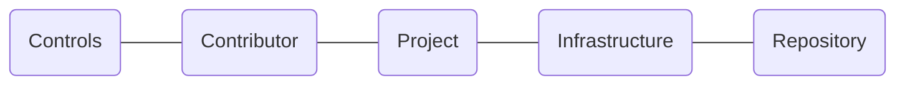

# The Factory Journeys

<!-- TOC -->
- [Factory toolkit](#factory-toolkit)
    - [Build the factory](#build-the-factory)
    - [Maintain the factory](#maintain-the-factory)
    - Quickstart projects
    - Pipeline library
    - On-demand
- [Engineer experience](#engineer-experience)
    - [Factory cli](#factory-cli)
    - Factory bot
    - Governance
    - Documentation production
<!-- /TOC -->

## Factory toolkit
<!-- TODO: doc(journey): describe the factory toolkit outcome -->

The outcome backlog can be found [here]().

### Build the factory
<!-- TODO: doc(journey): describe build the Factory -->


The journey backlog can be found [here]().

### Maintain the factory
<!-- TODO: doc(journey): describe maintain the factory -->


The journey backlog can be found [here]().


## Engineer experience
<!-- TODO: doc(journey): describe the engineer experience outcome -->

The outcome backlog can be found [here]().

### Factory cli
<!-- TODO: doc(journey): describe Factory cli -->

```mermaid
flowchart LR
    
```
The journey backlog can be found [here]().
