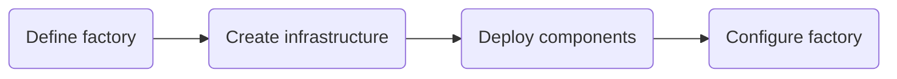
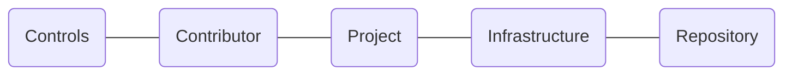

# The Factory Journeys

<!-- TOC -->
- [Factory toolkit](#factory-toolkit)
    - [Build the factory](#build-the-factory)
    - [Run the factory](#run-the-factory)
    - On-demand factory
- [Engineer experience](#engineer-experience)
    - [Factory cli](#factory-cli)
    - Factory bot
    - Factory dashboard
    - Engineering workflow automation
    - Governance automation
    - Documentation automation
- [Engineering accelerators](#engineering-accelerators)
    - Project quickstart
    - OSS quickstart
    - Pipeline library
- [ML factory](#ml-factory)
    - ML Scrum master
    - ML Product owner
    - ML DevOps
<!-- /TOC -->

## Factory toolkit
<!-- TODO: doc(journey): describe the factory toolkit outcome -->

The outcome backlog can be found [here]().

### Build the factory
<!-- TODO: doc(journey): describe build the Factory -->


The journey backlog can be found [here]().

### Run the factory
<!-- TODO: doc(journey): describe run the factory -->


The journey backlog can be found [here]().


## Engineer experience
<!-- TODO: doc(journey): describe the engineer experience outcome -->

The outcome backlog can be found [here]().

### Factory cli
<!-- TODO: doc(journey): describe Factory cli -->

```mermaid
flowchart LR
    
```
The journey backlog can be found [here]().


## Engineering accelerators
<!-- TODO: doc(journey): describe the engineering accelerators outcome -->

The outcome backlog can be found [here]()

## ML factory
<!-- TODO: doc(journey): describe the ML factory outcome -->

The outcome backlog can be found [here]()

