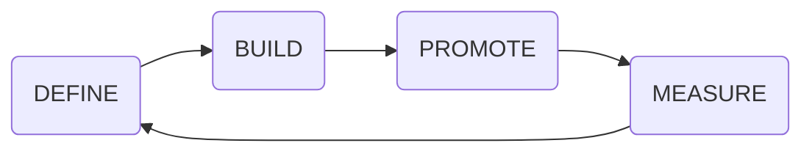
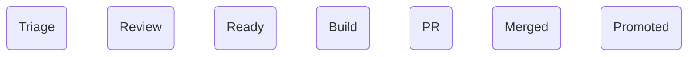
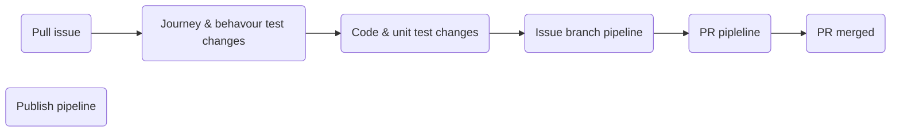
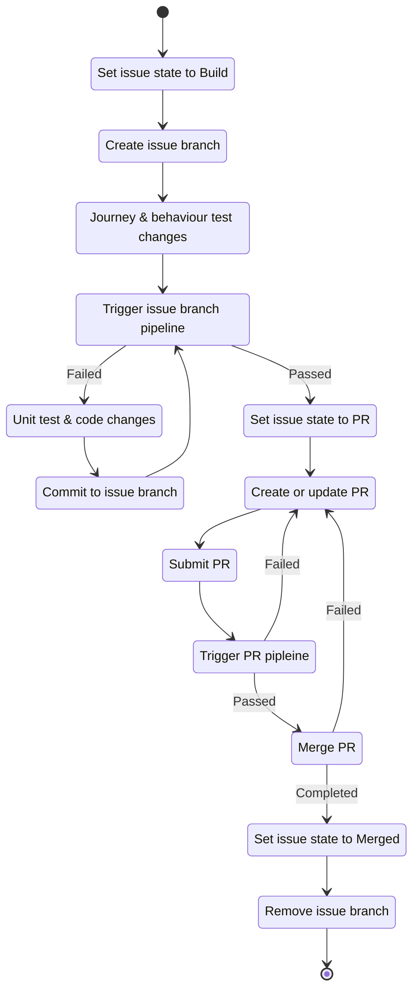
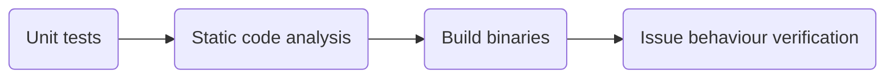
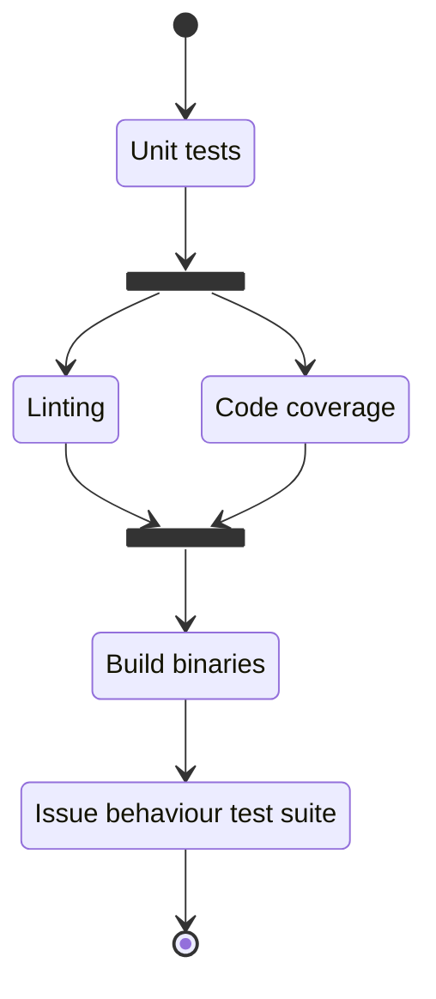
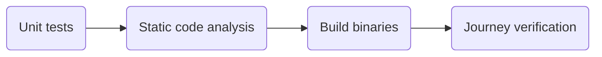
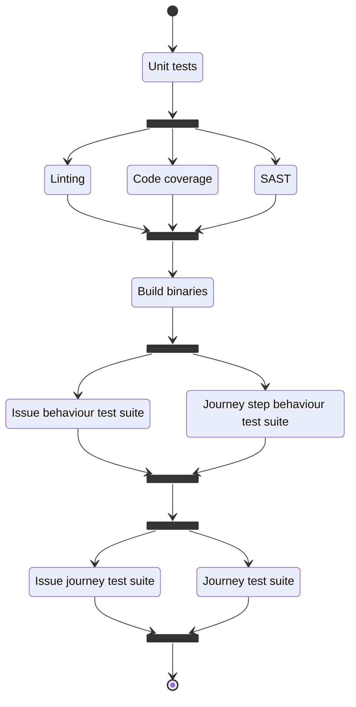

# Factory Pipeline Patterns
<!-- TODO: Description of continuous engineering pipeline -->

<!-- TOC -->
- [Issue states](#issue-states)
- [Build pipeline](#build-pipeline)
- [Issue branch pipeline](#issue-branch-pipeline)
- [PR pipeline](#pr-pipeline)
- [Publish pipeline](#publish-pipeline)
<!-- /TOC -->

## Issue states
<!-- TODO: Description of issue states -->

## Build pipeline
<!-- TODO: Description of build pipeline -->

#### State diagram

### Issue branch pipeline
<!-- TODO: Description of issue branch pipeline -->

#### State diagram

### PR pipeline
<!-- TODO: Description of PR pipeline -->

#### State diagram

### Publish pipeline
<!-- TODO: Description of issue branch pipeline -->
