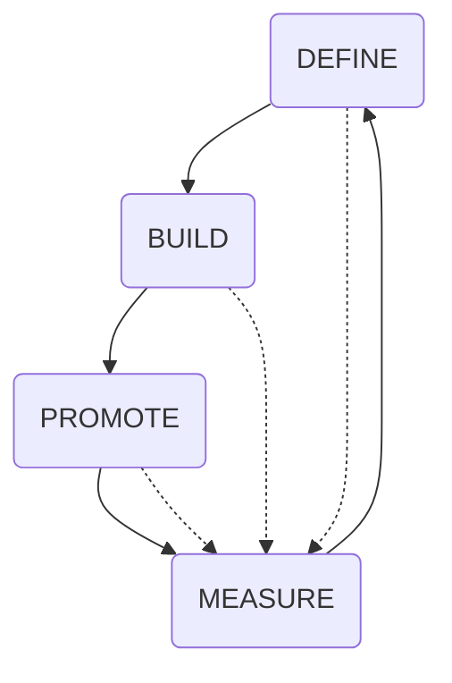

# Factory Pipeline Patterns



<!-- TOC -->
- [Issue pipeline](#issue-pipeline)
- [Engineering pipeline](#engineering-pipeline)
<!-- /TOC -->

## Issue pipeline
<!-- TODO: Desc - Issue pipeline -->


## Engineering pipeline
<!-- TODO: Desc - Engineering pipeline -->

```mermaid
flowchart LR

```
