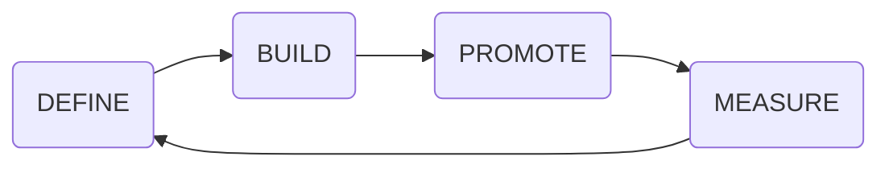
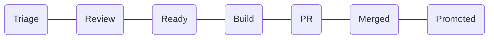
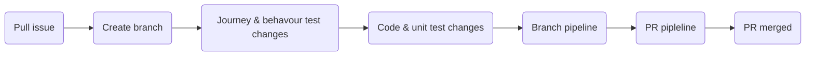
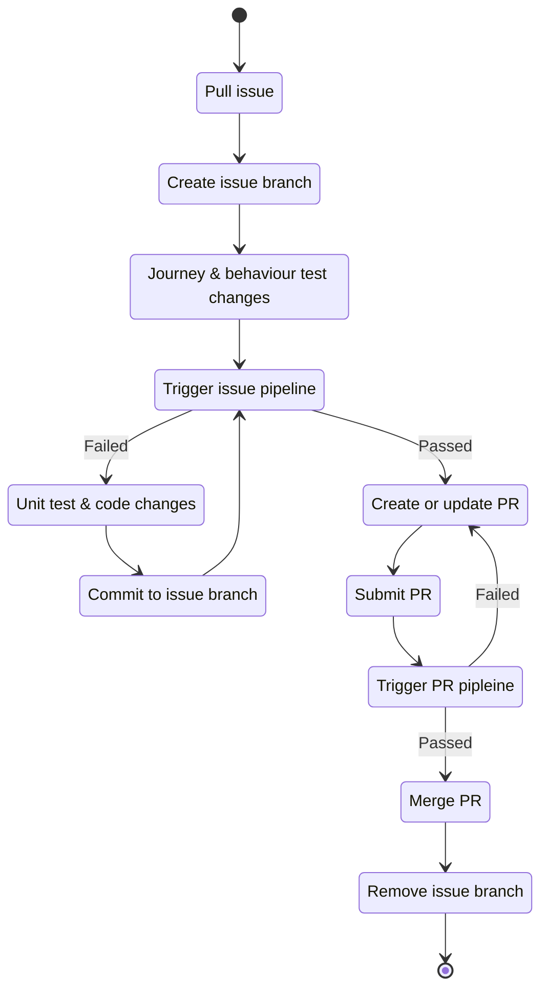

# Factory Pipeline Patterns
<!-- TODO: Description of continuous engineering pipeline -->

<!-- TOC -->
- [Issue pipeline](#issue-pipeline)
- [Build pipeline](#build-pipeline)
<!-- /TOC -->

## Issue pipeline
<!-- TODO: Description of issue pipeline -->

## Build pipeline
<!-- TODO: Description of build pipeline -->

#### State diagram

